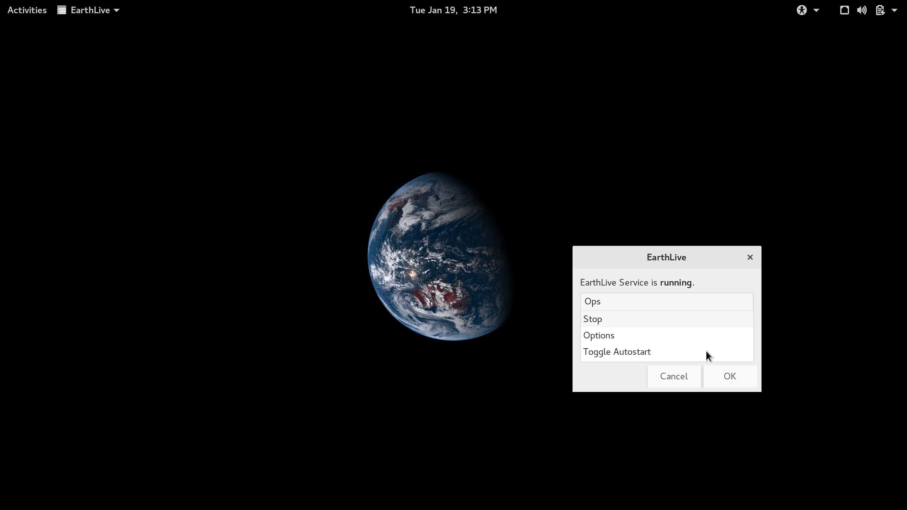

EarthLiveShell
==============
Live view of the Earth from space, a [EarthLiveSharp](https://github.com/bitdust/EarthLiveSharp) shell script implementation.



Images from [himawari8](http://himawari8.nict.go.jp) are currently delivered by my Cloudinary CDN. Change `CDN_PREFIX` variable in `src/Makefile` to your own CDN account to prevent CDN quota from exhausting.

Install
-------
__STOP the service before overwriting previous installation or you might lose original wallpaper settings!__ Go to `src`, edit `Makefile` if needed, type `make` and `sudo make install`

Options
-------
* `opt_interval`

Set the interval between two image checks.

* `opt_density`

Set the density of image. You'll need `imagemagick` installed if you have a Hi-DPI display and want to get a larger image for your desktop.

Requirements
------------
* `imagemagick` for wallpaper generation and tile concatenating if `opt_density` is larger than 1
* `curl` for image and json downloading
* Gnome, mate or unity
* and a live Internet connection

Auto-start on login
-------------------
After install, check the `earthlive-shell` for one-click autostart configuration.

If you like, you can manually set up autostart by making a symbolic link of `EarthLiveStart.desktop` in `~/.config/autostart`:
```
ln -sf /usr/local/share/applications/EarthLiveStart.desktop ~/.config/autostart/
```
